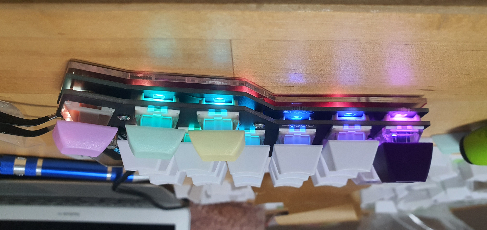

# keyboard_build

CRKBD Corne v3 Build Log / Setup

I wanted to improve my desk ergonomics so I decided to purchase a built it yourself keyboard kit.

For those in Japan you can purcashe the kit from here
<ul>
  <li><a href="https://shop.yushakobo.jp/"> https://shop.yushakobo.jp/</a>
  </ul>

The assembely requires soldering and little but of computer skills to flash the software on the keyboard.

There is an online guide available in both Japanese and English here at
<ul>
  <li><a href="https://github.com/foostan/crkbd">https://github.com/foostan/crkbd/</a>
  </ul>

  
I added a custom logo to the right side of the keyboard. 
  I used these two articles as a guide to do so.
  <ul>
    <li> <a href="https://docs.splitkb.com/hc/en-us/articles/360013811280-How-do-I-convert-an-image-for-use-on-an-OLED-display-">How do I convert an image for use on an OLED display?</a>
      <li> <a href="https://docs.splitkb.com/hc/en-us/articles/360010533820-What-can-you-use-an-OLED-display-for-">What can you use an OLED display for?</a>
  </ul>
  
  

